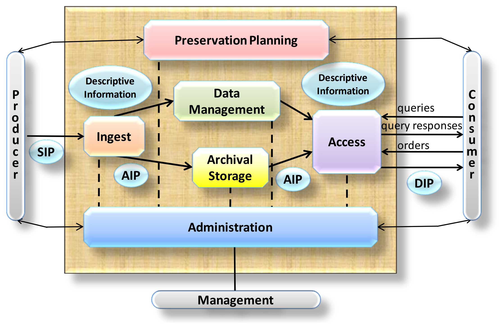

# OAIS Dataflows
## Using dataflow diagrams to explore the Open Archival Information System standard

<div class="caution" label="DRAFTY CONTENT WARNING!">This page is nowhere near complete, and may never be so!</div>

## The View From The Outside

```dataflow
dataflow 1.0
title "OAIS High-level Dataflow (External View)"
zoom 0.7
height 300

data sip "Submission Information Package" black
data aip "Archival Information Package" red
data dip "Dissemination Information Package" green

place consumer "Consumer" dc
place producer "Producer" dc
place store "Archival Storage" ar

start sip@producer
move sip@producer sip@store "Ingest SIP"
transform sip@store aip@store "SIP to AIP"
space
derive aip@store dip@store "Generate DIP"@N [0,1]
move dip@store dip@consumer "Access"
end
```


The View From The Inside

## Strictly Speaking

No Moves, No Transformations

```dataflow
dataflow 1.0
title "OAIS High-level Dataflow (Strict)"
zoom 0.8
height 300
"""
This is what the OAIS dataflow looks like from the outside. All of the internal detail is invisible to external users. In this 'strict' version there can be no 'move' or 'transform' steps.
"""

# First we define the details of the data involved in the flow. 
# This is used to define the colours of the data flow lines:
data sip "Submission Information Package" black
data aip "Archival Information Package" red
data dip "Dissemination Information Package" green

# Then we define the places and the domains those places belong to. 
# The order the places are defined here also defines the order in which they are laid on on the page, from top to bottom:
place consumer "Consumer" dc
place producer "Producer" dc
place store "Archival Storage" ar

# And then a more detail description of the domains:
domain dc "Designated Community"
domain ar "The Archive"

# ----------------------------
# With all the data, places and domains defined, we can start describing the sequence of events.
# Text wrapped in """ contain detailed descriptions for the preceding event.
# ----------------------------

# Start:
start sip@producer
"""Every dataflow starts by declaring what data exists where, before the dataflow begins. <br><br> For OAIS, we always start with a <i>Submission Information Package</i> that is held by a <i>Producer</i> that belongs to the archive's <i>Designated Community</i>."""

# Ingest:
copy sip@producer sip@store "Ingest"
"""The <i>Submission Information Package</i> is transferred to the <i>Archive</i> from the <i>Producer</i>."""

# Preserve:
derive sip@store aip@store "Generate AIP" [0,-1]
"""The <i>Archive</i> takes the <i>Submission Information Package</i> and turns it into an <i>Archival Information Package</i>, placing it on long-term storage."""

space
delete sip@store "Delete SIP"@N
delete sip@producer "Delete SIP"@N
space

# Access:
derive aip@store dip@store "Generate DIP"@N [0,0]
"""The <i>Archive</i> takes the <i>Archival Information Package</i> and generates a suitable <i>Dissemination Information Package</i> from it."""

copy dip@store dip@consumer "Access"
"""When the <i>Archive</i> receives a request from a <i>Consumer</i>, the <i>Dissemination Information Package</i> is returned."""

# Show the final state
end
```


Again, immediately, there is a tension because we are operating in the store, and we always need a workspace

## Separating Concerns


```dataflow
dataflow 1.0
title "OAIS High-level Dataflow (Strict)"
zoom 0.8
height 300
"""
This is what the OAIS dataflow looks like from the outside. All of the internal detail is invisible to external users.
"""

# First we define the details of the data involved in the flow. 
# This is used to define the colours of the data flow lines:
data sip "Submission Information Package" black
data aip "Archival Information Package" red
data dip "Dissemination Information Package" green

# Then we define the places and the domains those places belong to. 
# The order the places are defined here also defines the order in which they are laid on on the page, from top to bottom:
place consumer "Consumer" dc
place producer "Producer" dc
#place boundary "Boundary" ar
place workspace "Workspace" ar
place store "Archival Storage" ar

# And then a more detail description of the domains:
domain dc "Designated Community"
domain ar "The Archive"

# ----------------------------
# With all the data, places and domains defined, we can start describing the sequence of events.
# Text wrapped in """ contain detailed descriptions for the preceding event.
# ----------------------------

# Start:
start sip@producer
"""Every dataflow starts by declaring what data exists where, before the dataflow begins. <br><br> For OAIS, we always start with a <i>Submission Information Package</i> that is held by a <i>Producer</i> that belongs to the archive's <i>Designated Community</i>."""

# Ingest:
copy sip@producer sip@workspace "Receive SIP"
"""The <i>Submission Information Package</i> is transferred to the <i>Archive</i> from the <i>Producer</i>."""

derive sip@workspace aip@workspace "Generate AIP" [0,-1]
"""The <i>Archive</i> takes the <i>Submission Information Package</i> and turns it into an <i>Archival Information Package</i>, placing it on long-term storage."""

# Preserve:
copy aip@workspace aip@store "Store AIP"

space
delete aip@workspace,sip@workspace "Delete\nAIP & SIP"@N
delete sip@producer "Delete SIP"@N

space

# Access:
copy aip@store aip2@workspace "Read AIP"
derive aip2@workspace dip@workspace "Generate DIP"@N [0,0]
"""The <i>Archive</i> takes the <i>Archival Information Package</i> and generates a suitable <i>Dissemination Information Package</i> from it."""

copy dip@workspace dip@consumer "Deliver DIP"
"""When the <i>Archive</i> receives a request from a <i>Consumer</i>, the <i>Dissemination Information Package</i> is returned."""

# Show the final state
end
```


```dataflow
dataflow 1.0
title: "OAIS Internal Dataflow"
zoom 0.8
offset 0 6

"""
This is an example dataflow.
"""

# Locations where data can be stored:
place producer.dc "Producer"
place consumer.dc "Consumer"
place ingest.ar "Ingest Storage"
place access.ar "Access Storage"
place store.ar "Archival Storage"

# Domains where locations are maintained:
domain dc "Designated Community"
domain ar "The Archive"
domain man "Management"

# Data types and descriptions:
data sip "Submission Information Package" black
data aip "Archival Information Package" red
data dip "Dissemination Information Package" green

#
# Then the sequence of events in this dataflow...
#


# We start by transferring a package from an external party:
start sip@producer.dc
move sip@producer.dc sip@ingest.ar "Transfer to the archive"
"""
A detailed explanation of what happens at this point.
"""

space

# We then prepare the item for ingest to the archival storage storage system:
derive sip@ingest.ar aip@ingest.ar "Generate AIP from SIP" [0,-1]
space
copy aip@ingest.ar aip@store.ar "Copy to archival storage" 
# And delete the temporary files:
delete sip@ingest.ar,aip@ingest.ar
space

# When access is requested, we generate an access copy:
copy aip@store.ar aip@access.ar "Retrieve the AIP"
derive aip@access.ar dip@access.ar "Generate the DIP"@N [0,0]
space
copy dip@access.ar dip@consumer.dc "Send the DIP"
delete aip@access.ar,dip@access.ar

# And we're done:
end
```

## Comparison with OAIS

Add more complex version, based on exploding this:


 
So this is one layer in from the external view, but still higher-level than the full functional model...

Figure 4-1: OAIS Functional Entities


```js
import { renderDataflows } from "./dataflows.js";
renderDataflows();
```