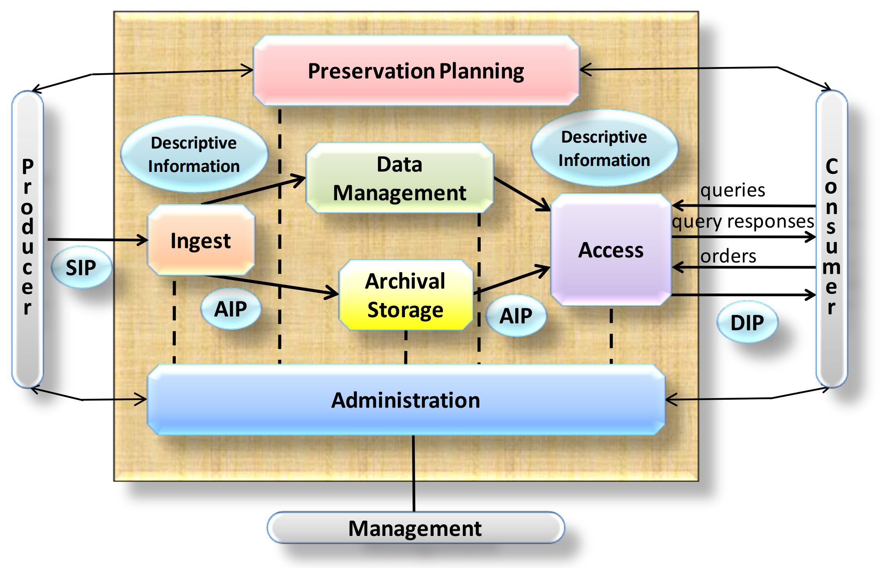

# OAIS Dataflows
## Using dataflow diagrams to explore the Open Archival Information System standard

Here we use Dataflow diagrams to explore some aspects of the [OAIS Reference Model (ISO 14721)](http://www.oais.info/).

## The High-Level View

We start by looking at the OAIS environment and at the definitions of the packages that come in and out of the archive:

> **Submission Information Package (SIP)**: An Information Package that is delivered by the
Producer to the OAIS for use in the construction or update of one or more AIPs and/or the
associated Descriptive Information.
>
> **Archival Information Package (AIP)**: An Information Package, consisting of the Content
Information and the associated Preservation Description Information (PDI), which is
preserved within an OAIS.
>
> **Dissemination Information Package (DIP)**: An Information Package, derived from one or
more AIPs, and sent by Archives to the Consumer in response to a request to the OAIS.

This core workflow from _Producer_ to _Archive_ to _Consumer_ (_SIP > AIP > DIP_) can be visualised like so: 

```dataflow
dataflow 1.0
title "OAIS High-level Dataflow"
zoom 0.7
height 300

data sip "Submission Information Package" black
data aip "Archival Information Package" red
data dip "Dissemination Information Package" green

place consumer "Consumer" dc
place producer "Producer" dc
place store "Archival Storage" ar

start sip@producer
transfer sip@producer sip@store "Ingest SIP"
"""A <b>Submission Information Package (SIP)</b> is delivered by the Producer to the OAIS for use in the construction or update of one or more AIPs and/or the associated Descriptive Information."""

transform sip@store aip@store "SIP to AIP"
"""An <b>Archival Information Package (AIP)</b> is generated, consisting of the Content Information and the associated Preservation Description Information (PDI), which is preserved within an OAIS."""
space
derive aip@store dip@store "Generate DIP"@N [0,1]
"""A <b>Dissemination Information Package (DIP)</b> is derived from one or more AIPs, and sent by Archives to the Consumer in response to a request to the OAIS."""

transfer dip@store dip@consumer "Access"

end
```

## Separating Concerns

The high-level diagram captures the interaction between the archive and the wider environment, on it's own it does not help understand what is going on within the archive.

Crucially, in order to manage access rights and separate concerns, every _Archive_ operates multiple digital storage platforms, not just _Archival Storage_. Additional storage is used to handle incoming and outgoing content, with the former supporting things like _Pre-Ingest Workflows_ and the latter supporting e.g. _Access Services_. 

## Adding a Workspace

In situations where the _Archive's_ _Consumers_ are also _Producers_, it may be sufficient to define a single _Workspace_ storage domain that provides a place to work with digital content while remaining safely isolated from the _Archival Storage_.

```dataflow
dataflow 1.0
title "OAIS High-level Dataflow (Strict)"
zoom 0.8
height 300
"""
This is what the OAIS dataflow looks like from the outside. All of the internal detail is invisible to external users.
"""

# First we define the details of the data involved in the flow. 
# This is used to define the colours of the data flow lines:
data sip "Submission Information Package" black
data aip "Archival Information Package" red
data dip "Dissemination Information Package" green

# Then we define the places and the domains those places belong to. 
# The order the places are defined here also defines the order in which they are laid on on the page, from top to bottom:
place consumer "Consumer" dc
place producer "Producer" dc
#place boundary "Boundary" ar
place workspace "Workspace" ar
place store "Archival Storage" ar

# And then a more detail description of the domains:
domain dc "Designated Community"
domain ar "The Archive"

# ----------------------------
# With all the data, places and domains defined, we can start describing the sequence of events.
# Text wrapped in """ contain detailed descriptions for the preceding event.
# ----------------------------

# Start:
start sip@producer
"""Every dataflow starts by declaring what data exists where, before the dataflow begins. <br><br> For OAIS, we always start with a <i>Submission Information Package</i> that is held by a <i>Producer</i> that belongs to the archive's <i>Designated Community</i>."""

# Ingest:
copy sip@producer sip@workspace "Receive SIP"
"""The <i>Submission Information Package</i> is transferred to the <i>Archive</i> from the <i>Producer</i>."""

derive sip@workspace aip@workspace "Generate AIP" [0,-1]
"""The <i>Archive</i> takes the <i>Submission Information Package</i> and turns it into an <i>Archival Information Package</i>, placing it on long-term storage."""

# Preserve:
copy aip@workspace aip@store "Store AIP"

space
delete aip@workspace,sip@workspace "Delete\nAIP & SIP"@N
delete sip@producer "Delete SIP"@N

space

# Access:
copy aip@store aip2@workspace "Read AIP"
derive aip2@workspace dip@workspace "Generate DIP"@N [0,0]
"""The <i>Archive</i> takes the <i>Archival Information Package</i> and generates a suitable <i>Dissemination Information Package</i> from it."""

copy dip@workspace dip@consumer "Deliver DIP"
"""When the <i>Archive</i> receives a request from a <i>Consumer</i>, the <i>Dissemination Information Package</i> is returned."""

# Show the final state
end
```

## Towards the Functional Model

In general, however, _Producers_ and _Consumers_ are distinct audiences and it makes sense to provision separate storage systems and caches to ensure _write access_ and _read access_ rights are managed appropriately.

While the OAIS Functional Model only focuses on the archival functions rather than dictating system design, this idea does align reasonably well with the _OAIS Functional Entities_:


 
If we take this idea and express it as a Dataflow, we can fully separate the _Ingest_ and _Access_ processes and make it clear that they use separate storage.

```dataflow
dataflow 1.0
title: "OAIS Internal Dataflow"
zoom 0.8
offset 0 6

"""
This is an example dataflow.
"""

# Locations where data can be stored:
place producer.dc "Producer"
place consumer.dc "Consumer"
place ingest.ar "Ingest Storage"
place access.ar "Access Storage"
place store.ar "Archival Storage"

# Domains where locations are maintained:
domain dc "Designated Community"
domain ar "The Archive"
domain man "Management"

# Data types and descriptions:
data sip "Submission Information Package" black
data aip "Archival Information Package" red
data dip "Dissemination Information Package" green

#
# Then the sequence of events in this dataflow...
#


# We start by transferring a package from an external party:
start sip@producer.dc
move sip@producer.dc sip@ingest.ar "Transfer to the archive"
"""
A detailed explanation of what happens at this point.
"""

space

# We then prepare the item for ingest to the archival storage storage system:
derive sip@ingest.ar aip@ingest.ar "Generate AIP from SIP" [0,-1]
space
copy aip@ingest.ar aip@store.ar "Copy to archival storage" 
# And delete the temporary files:
delete sip@ingest.ar,aip@ingest.ar "Delete\nSIP & AIP"@E
space

# When access is requested, we generate an access copy:
copy aip@store.ar aip@access.ar "Retrieve the AIP"
derive aip@access.ar dip@access.ar "Generate the DIP"@N [0,0]
space
copy dip@access.ar dip@consumer.dc "Send the DIP"
delete aip@access.ar,dip@access.ar "Delete\nAIP & DIP"@E

# And we're done:
end
```

This also makes it clear that, when transferring data between storage systems, there is always actually some kind of _"Copy And Then Delete"_ process going on rather than some kind of simple _"Move"_. 


```js
import { renderDataflows } from "./dataflows.js";
renderDataflows();
```