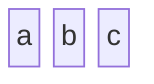

# UKWA Dataflows
## How the UK Web Archive worked (c.2023)

<div class="caution" label="DRAFTY CONTENT WARNING!">This page is nowhere near complete, and may never be so!</div>

This documents my understanding of the UK Web Archive dataflow in mid-2023.

## Introduction

blah. Data Lake.

## Dataflow

```dataflow
dataflow 1.0
title: "UKWA Crawler Dataflow"
zoom 0.9
height 300
offset 10 0

# Locations where data can be stored:
place internet "Internet"
place crawler "Crawler"
place hadoop "Archival\nStorage"
place w3act "W3ACT"

# Data types and descriptions:
data website "Website" black
data warcs "WARCS" red
data md "Metadata" blue
data w3act "W3ACT" darkblue

# Events
start website@internet
start w3act@w3act
derive w3act@w3act md@w3act "Export\nDatabase" [0,-1]
move md@w3act md@hadoop "Copy to HDFS"
copy md@hadoop md@crawler "Update Crawl Targets"
space


copy website@internet website@crawler "Crawl"
space
transform website@crawler warcs@crawler "Package\nWARCs"@N
copy warcs@crawler warcs@hadoop "Copy to\nHDFS"
delete warcs@crawler "Delete\nWARCs"@N

# And we're done:
end
```


```dataflow
dataflow 1.0
title: "UKWA Playback Dataflow"
zoom 0.9
height 300
offset 10 0

# Locations where data can be stored:
place internet "Internet"
place pywb "PyWB"
place cdx "CDX Index"
place hadoop "Archival\nStorage"

# Domains where locations are maintained:
domain public "Public Network"
domain n45 "Service Network"
domain n1 "Storage Network"

# Data types and descriptions:
data website "Website" black
data warcs "WARCS" red
data md "Metadata" blue
data w3act "W3ACT" darkblue
data cdx "CDX" orange
data query "Query" black
data playback "Playback" green

start website@internet
start warcs@hadoop,md@hadoop

space
derive warcs@hadoop cdx@hadoop "Generate CDX"@N [0,1]
move cdx@hadoop cdx@cdx "Update\nCDX Server"@E 

move query@internet query@pywb "Request URL"
copy cdx@cdx cdx@pywb "Query CDX" 
copy warcs@hadoop warcs@pywb "Get WARC"
transform warcs@pywb playback@pywb "Rewrite\nResource"@N [0,1]
move playback@pywb playback@internet "Deliver"@E

# And we're done:
end
```

<!-- See https://mermaid.js.org/syntax/block.html -->


```js
import { renderDataflows } from "./dataflows.js";
renderDataflows();
```