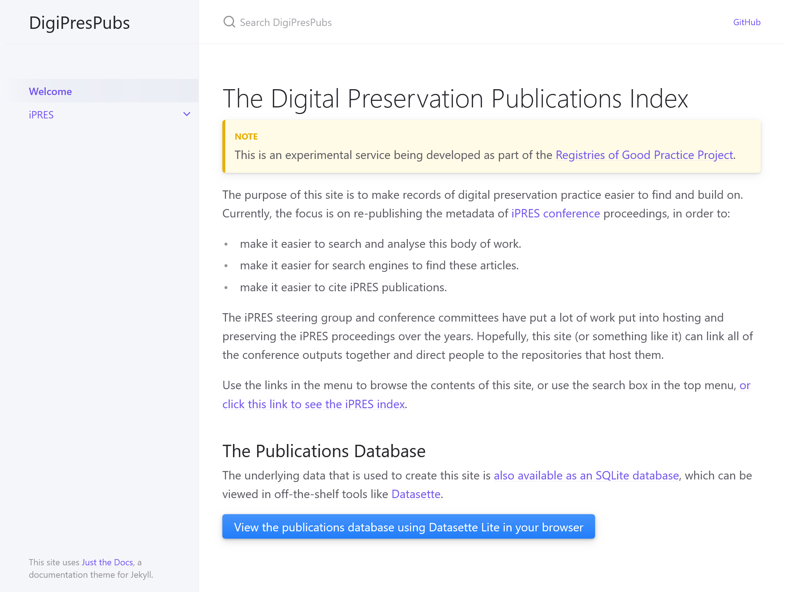

# Putting iPRES 2024 in Context
## Part of the iPRES 2024 Workshop "Digital Preservation Registries: What We Have & What We Need"

## Goal

The goal of this activity is to introduce you to [the Digital Preservation Publications Index](https://digipres.org/publications/), use it to help place [iPRES 2024](https://ipres2024.pubpub.org/) in context, and get your feedback on how it goes and what could be improved.

We'll work together to find relevant papers from the twenty-year history of iPRES and connect them to this year's publications using the conference platform's commenting system.

## Preparation

- Go to [the iPRES 2024 site](https://ipres2024.pubpub.org/) and [sign up for an account](https://ipres2024.pubpub.org/signup) (if you haven't already).
- Make sure you are [logged in](https://ipres2024.pubpub.org/login).
- Keep this page open, and open new windows/tabs for:
  - [The iPRES 2024 Search Page](https://ipres2024.pubpub.org/search)
  - [The Publications Index](https://www.digipres.org/publications/)

## Process

- Use the coordination spreadsheet below to find a paper you'd like to work with. Leave some unique identifier (like your initials, or your favourite colour/color/biscuit/musician/beverage/utensil/parent/child etc.) in the _Working On It_ columns. That way we can avoid duplicating effort.

<h2>Who Goes There?!</h2>
<h3>Use this Google Sheet to coordinate our efforts by putting any unique marker in the cell marked <i>Working On It...</i></h3>
<iframe src="https://docs.google.com/spreadsheets/d/1NxfOfl-4tPiZQlVp5AWYr075lZx8-iF8q0fHPW5dyUk/edit?gid=0#gid=0" style="width: 100%; height: 400px; border: 1px solid black;">
</iframe>

[Click here to open this Google Sheet in a new tab.](https://docs.google.com/spreadsheets/d/1NxfOfl-4tPiZQlVp5AWYr075lZx8-iF8q0fHPW5dyUk/edit?gid=0#gid=0)

- Go to or [search for](https://ipres2024.pubpub.org/search) the article, open it up, give it a quick scan.
  - If the publications has keywords, they should link back to the _Publications Index_, so you could try that, or...
- Go to the [Publications Index](https://digipres.org/publications/) and use it to search for related papers.
  - Note that the _Publications Index_ has two access/search systems, one plain website-style search and a more complicated but powerful database-driven system. Please try them both!
- If you find something interesting, use the _iPRES 2024_ commenting system to add a note linking to the related paper(s) and describing how they are connected.
  - Please don't just put a link in with no explanation.
  - If you have some personal connection to the linked work, please make that clear!
  - Maybe try looking for other papers by the authors, or variations on the keywords.
  - Take your marker out of the Google Sheet when you move on.
- If you have any difficulties, let us know!
- If you have any feedback, let us know! The [Feedback section](#feedback) below provides some more detail on feedback we'd like and a way to pass feedback to us anonymously if you prefer.

## Feedback

We'd like any and all feedback about the iPRES Proceedings and the Publications Index. e.g.

- What other sources of relevant publications should we include in the index?
- What additional fields or functionality would have helped?
- What additional documentation or support should we add?
- Are the _keywords_ links from iPRES 2024 publications to the _Publications Index_ helpful?
- What should the digital preservation community and the [iPRES Steering Group](https://ipres-conference.org/) do with the iPRES Proceedings?

You can use the _Padlet_ below to leave feedback, or add a 👍/👎 to the feedback that's already there. Unless you have specifically logged into the _Padlet_ service, this feedback will be anonymous. Either way, please be kind.

<iframe src="https://padlet.com/anj/breakout-link/E1Xd49Nyrb6A2GJr-1JkMb0Rm04rJXdD8" style="width: 100%; height: 800px; border: 1px solid black;"></iframe>

