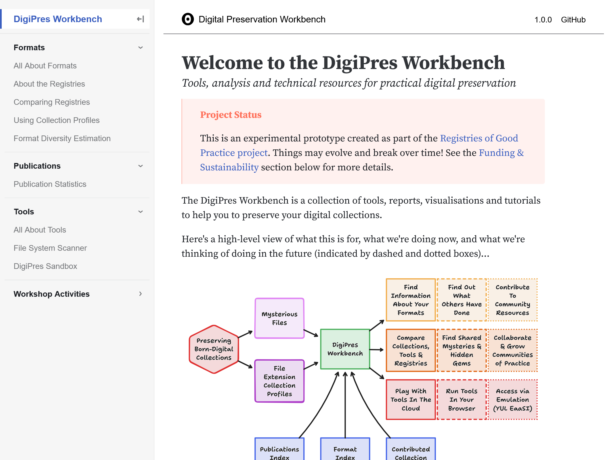

# Welcome to the Workbench!
## Part of the iPRES 2024 Workshop "Digital Preservation Registries: What We Have & What We Need"

## Goal

The goal of this activity is to introduce you to the [Digital Preservation Workbench](https://digipres.org/workbench/), explore what it can do, and get your feedback on what works and what doesn't.

There are a range of specific activities listed in the _Process_ section below. Just pick one that looks interesting and have a go.  If you have any questions or problems doing that, we'd like to know!

## Process

- Start at [the Digital Preservation Workbench homepage](https://digipres.org/workbench/).
- Use it to do one or more of:
  - Understand format registries and how they can be combined.
  - Compare the contents of format registries.
  - Compare a collection with those of other institutions. Possibly including your own!
  - Find out what tools might help identify the formats in a collection.
  - Understand how we have estimated the scale of the format challenge.
  - Explore the statistics and connections within the _Digital Preservation Publications Index_.
  - Play with command-line tools in the cloud, without leaving your browser.
- Let us know how this worked, which bits you liked, and which bits need more work or should be dropped.

## Feedback

The _Digital Preservation Workbench_ is really a combination of a number of different prototypes and experiments. It may not be possible to maintain everything over the long term, so it's important for us to know where you see the most potential for these things to be of _practical use in the execution of the work of digital preservation_.

You can use the _Padlet_ below to leave feedback, or add a 👍/👎 to the feedback that's already there. Unless you have specifically logged into the _Padlet_ service, this feedback will be anonymous. Either way, please be kind.

<iframe src="https://padlet.com/anj/breakout-link/3jXMqplPerLOqAzx-1JkMb0Rm04rJXdD8" style="width: 100%; height: 800px; border: 1px solid black;"></iframe>